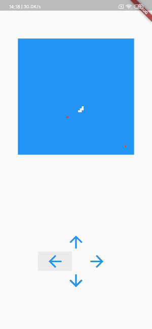

flutter-reactive-snake
===

> flutter rxdart 响应式 贪吃蛇

[在线体验](https://hcanyz.github.io/flutter-reactive-snake/)



###  构建环境
```
flutter --version
Flutter 1.19.0-2.0.pre.142 • channel master • https://github.com/flutter/flutter.git
Framework • revision 721927efd3 (27 hours ago) • 2020-05-21 17:52:02 -0700
Engine • revision 9ce1e5c5c7
Tools • Dart 2.9.0 (build 2.9.0-10.0.dev 7706afbcf5)
```

### 参考学习
https://blog.thoughtram.io/rxjs/2017/08/24/taming-snakes-with-reactive-streams.html  
https://juejin.im/post/5acb32dd5188255c637b41fb